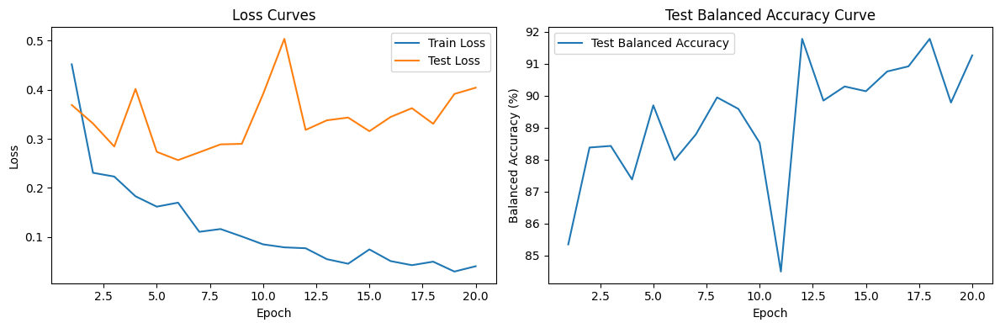
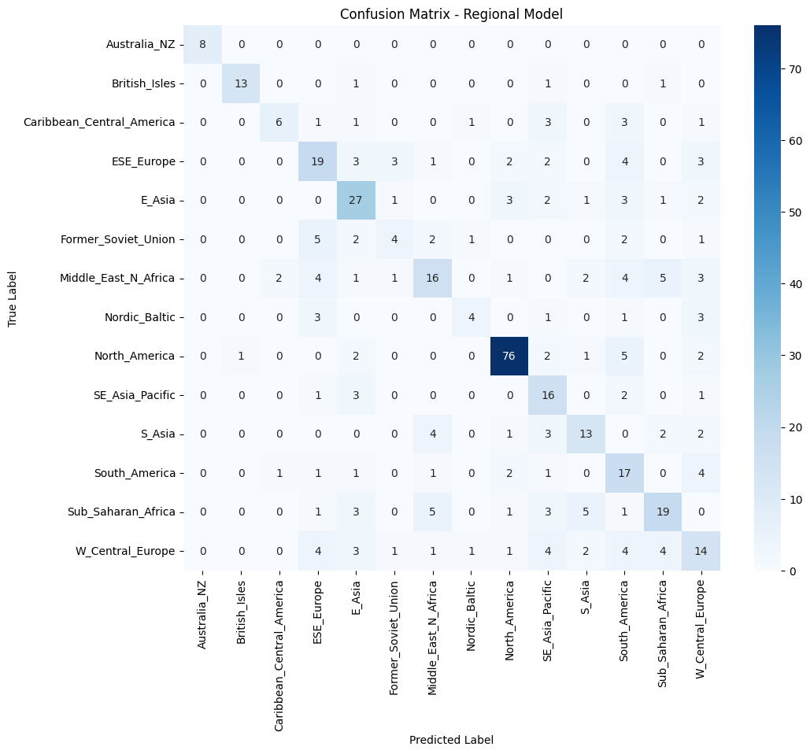
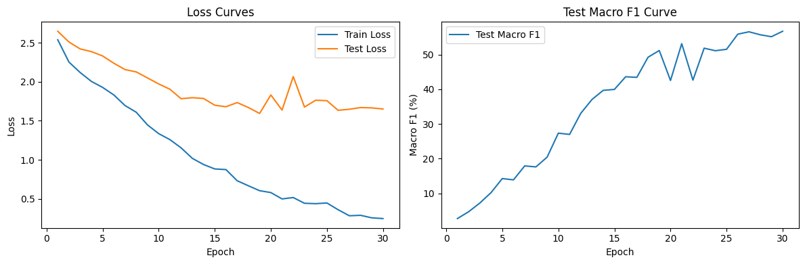

# Application of Machine Learning for Accent Prediction

**By Justin Frandsen**

## Abstract
This project investigates the use of machine learning, particularly fine-tuning Wav2Vec 2.0, for accent classification. Using the Speech Accent Archive dataset from Kaggle, we trained two models: a binary classifier distinguishing native English speakers from non-native ones, and a multiclass model predicting regional origin. Despite hardware limitations, the models achieved strong results, especially in binary classification. The work was guided by existing literature and inspired by platforms like BoldVoice, demonstrating both research and practical relevance.

## Introduction
Accent prediction analyzes spoken audio to infer a speaker’s linguistic background. It’s influenced by a range of factors including native language, birthplace, and regional exposure. With advancements in deep learning and pre-trained speech models, this task is now more accessible.

This project addresses three tasks: identifying native language, classifying by birthplace region, and distinguishing between English vs. Non-English speakers. All models use standardized audio inputs derived from the Speech Accent Archive. Our main focus is the binary classification model due to clearer label definitions and more promising performance.

Inspired by [Diving Deep into Speech Accent Classification](https://medium.com/data-and-beyond/diving-deep-into-speech-accent-classification-a-case-study-3ab333e28d0), we follow a transfer learning approach using Wav2Vec 2.0, emphasizing minimal manual feature engineering and leveraging robust audio representations.

## Related Work
Earlier studies focused on handcrafted features (e.g., MFCCs), while modern research uses deep learning models like Wav2Vec 2.0, which learn audio representations directly from raw waveforms. BoldVoice’s real-world tools highlight commercial viability in accent detection, while our approach mirrors self-supervised learning pipelines from research.

Key limitations remain: imbalanced data, computing constraints, and limited labeled samples for rare accents.

## Methods

### Dataset
We used the [Speech Accent Archive](https://www.kaggle.com/datasets/rtatman/speech-accent-archive) containing 2,138 audio samples and metadata like native language, country, and birthplace. Preprocessing included converting MP3s to WAV format.

#### Labeling and Region Mapping
For binary classification, an `is_english` column was added:
- **English:** 579 samples (27.08%)
- **Non-English:** 1,559 samples (72.92%)

To build the region-based model, countries were normalized and mapped into 14 linguistically-informed regions:

```
{
0: 'Australia_NZ', 1: 'British_Isles', 2: 'Caribbean_Central_America',
3: 'E_Asia', 4: 'ESE_Europe', 5: 'Former_Soviet_Union',
6: 'Middle_East_N_Africa', 7: 'Nordic_Baltic', 8: 'North_America',
9: 'S_Asia', 10: 'SE_Asia_Pacific', 11: 'South_America',
12: 'Sub_Saharan_Africa', 13: 'W_Central_Europe'
}
```

### Addressing Class Imbalance
Both models face significant imbalance. We used:
- **WeightedRandomSampler** to balance mini-batches.
- **Class-weighted loss (CrossEntropyLoss)** to amplify underrepresented classes.
- **Balanced Accuracy** as the evaluation metric.

### Preprocessing
- Resample to 16kHz
- Filter out noisy recordings
- Pad or truncate to 10 seconds (160000 samples)
- Stratified train-test splits

### Model Architecture

#### Native Language (Binary) Model
Built on `facebook/wav2vec2-base`, with:
- Last 2 encoder layers unfrozen for fine-tuning
- Classification head:
```
nn.Sequential(
nn.Linear(hidden_size, 256),
nn.ReLU(), nn.Dropout(0.2),
nn.Linear(256, 2)
)
```

#### Region Model
Also based on Wav2Vec 2.0, with key adaptations:
- Last 4 layers unfrozen
- Classification head for 14 regions with dropout (0.4)
- Data augmentation using `audiomentations`:
  - Gaussian noise, pitch shift, time stretch (p=0.3 each)

**Training Details (Region Model):**
- Optimizer: AdamW (lr=2e-5, weight decay=0.02)
- Scheduler: ReduceLROnPlateau
- Batch Size: 8
- Epochs: 30 (with early stopping)
- Platform: Google Colab (GPU)

### Training Summary
- Loss: CrossEntropy with weights
- Regularization: Dropout
- Strategy: Early stopping, learning rate scheduling

## Results

### Binary Model: Native English vs Non-English

| Metric                  | Value   |
|-------------------------|---------|
| Accuracy                | 92.99%  |
| Balanced Accuracy       | 91.78%  |
| Precision (English)     | 85%     |
| Recall (English)        | 90%     |
| F1 Score (English)      | 87%     |
| Precision (Non-English) | 96%     |
| Recall (Non-English)    | 94%     |
| F1 Score (Non-English)  | 95%     |

- Best checkpoint: Epoch 12
- Configuration: 25 epochs, lr = 3e-5, dropout = 0.2, AdamW



### Region Model

- **Balanced Accuracy:** 56.36%
- **Macro F1-Score:** 56.74%




## Discussion

### Performance Overview
The binary model performed strongly, with **balanced accuracy of 91.78%**, driven by class weighting and sampling techniques. High **recall for English (90%)** indicates success despite class imbalance.

The region model showed moderate performance due to:
- Severe class imbalance
- Less distinct phonetic variation between some regions
- Hardware limits on deeper fine-tuning

### Common Error Patterns
- **False positives:** Non-native speakers with near-native fluency
- **False negatives:** Native speakers with mixed or non-standard accents

### Challenges
- **Hardware limits** restricted batch sizes and experimentation
- **Data imbalance** affected generalization, especially in the region model
- **Long training time** due to model size and limited GPU access

### Future Work
- Add more training samples, especially for underrepresented regions
- Use lighter models (e.g., DistilWav2Vec)
- Expand data augmentation methods
- Explore more granular region labeling

### Potential Applications
- **Customer service routing** based on detected accent region
- **Accent training for actors**, offering feedback and region matching
- **Linguistic research** into accent variations and identity

## Conclusion
This project showed that transfer learning with Wav2Vec 2.0 can effectively classify accents, especially in binary English vs. Non-English tasks. Region classification is more challenging but promising with further data and tuning. Accent prediction holds potential in language learning, accessibility, and personalized AI interfaces.

## References
- [Diving Deep into Speech Accent Classification - Medium](https://medium.com/data-and-beyond/diving-deep-into-speech-accent-classification-a-case-study-3ab333e28d0)
- [BoldVoice Accent Strength Tool](https://accent-strength.boldvoice.com/)
- [Speech Accent Archive - Kaggle](https://www.kaggle.com/datasets/rtatman/speech-accent-archive)
- Baevski et al., *wav2vec 2.0: A Framework for Self-Supervised Learning of Speech Representations*, [arXiv](https://arxiv.org/abs/2006.11477)

